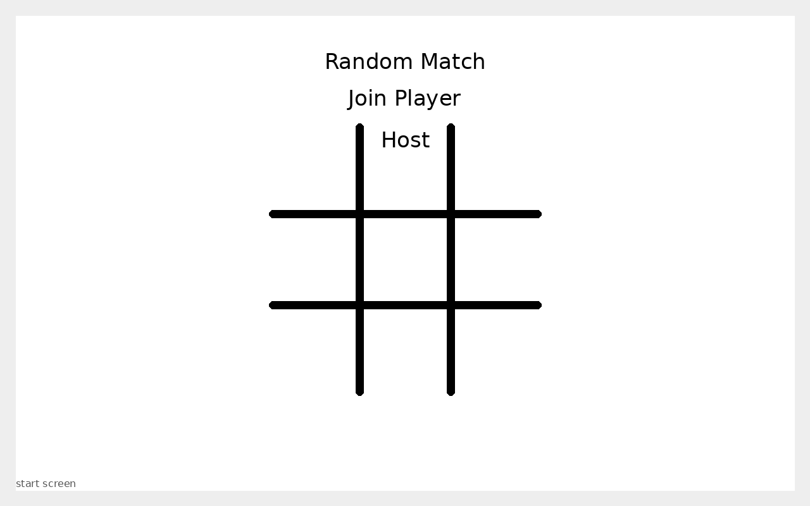
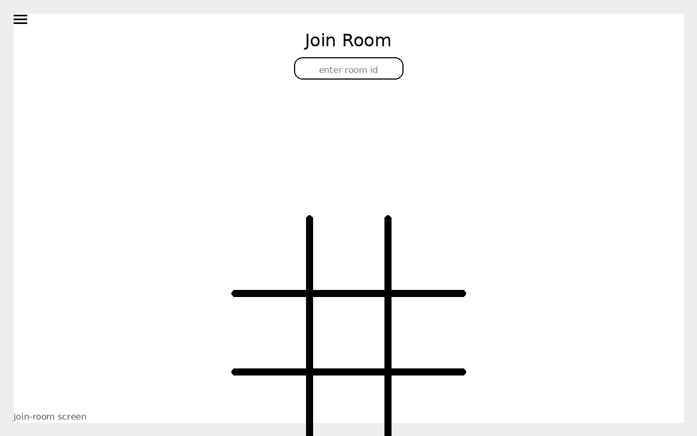
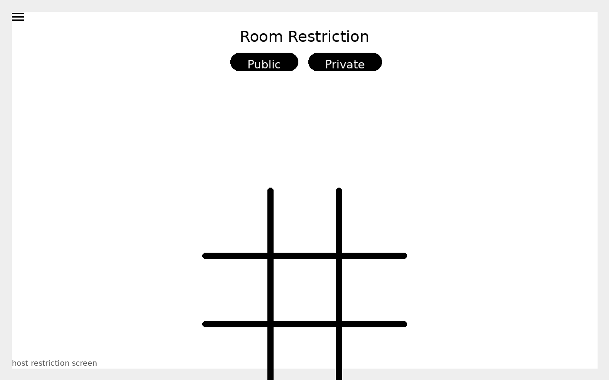
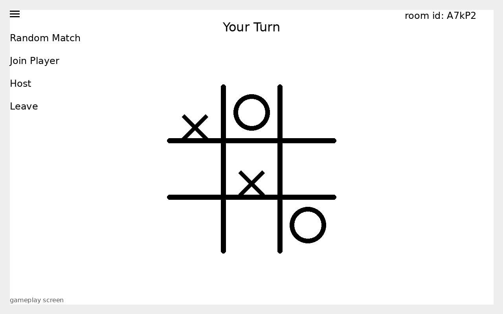
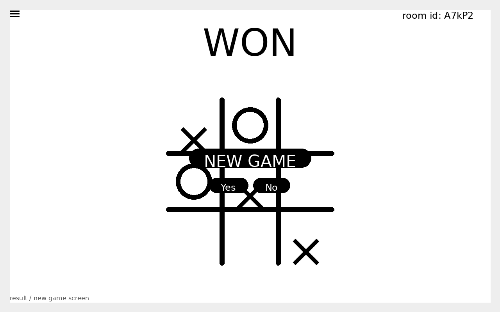
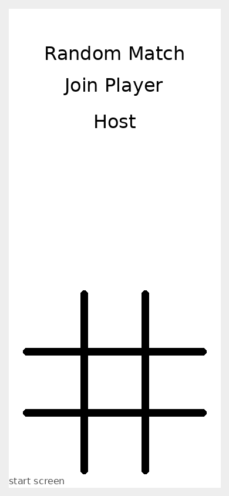

# Tic-Tac-Toe Online — Built App Snippets

Visual snippets captured from a local static render of the app’s built UI states. The repository describes the app as a real-time two-player Tic-Tac-Toe game using Express 5 and Socket.IO 4.

## Start screen

## Join room flow

## Host room restriction

## Gameplay state

## Result / new game prompt

## Mobile layout

## UI elements represented

- Main start actions: **Random Match**, **Join Player**, and **Host**.
- Join form with room-id input.
- Host restriction picker: **Private** / **Public**.
- In-game room id, status text, side menu, and 3×3 board.
- End-game result with **NEW GAME** confirmation.

## Repository run notes

The repository README says to install dependencies with `npm install`, then run the server with `npm start` or `npm run dev`, and open `http://localhost:3000` in a browser.
